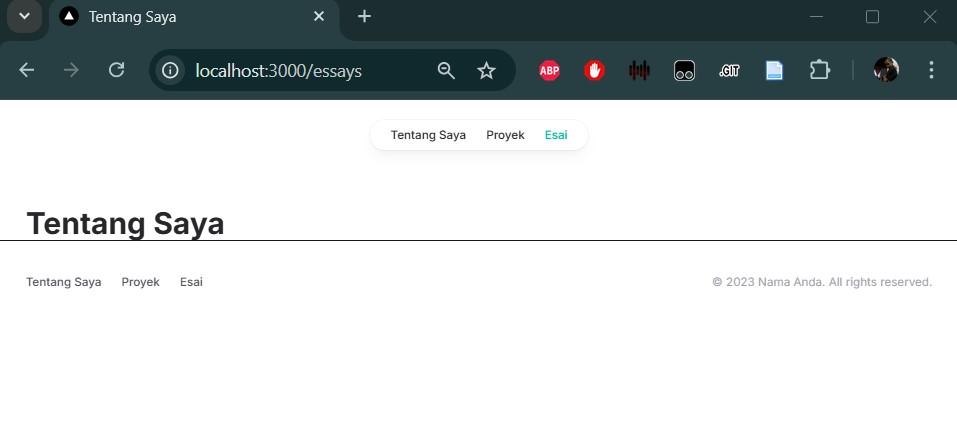

# Week 05 - Pengenalan Next.js

**Nama :** Ellois Karina Handoyo `<br>`
**NIM :** 2241720154 `<br>`
**Kelas :** TI-3C `<br>`
**Absen :** 9

## 1. Persiapan Lingkungan

1. Inisialisasi proyek Next.js dengan TypeScript dan App Router:
   ``
2. Jalankan aplikasi Next.js
   ``

## 2. Membuat Halaman Website

Website pribadi akan memiliki Ɵga halaman:

1. Tentang Saya: Halaman berisi profil singkat dan link ke media sosial.
2. Proyek: Halaman untuk menampilkan proyek-proyek yang telah diselesaikan.
3. Esai: Halaman untuk menampilkan daŌar arƟkel yang telah ditulis.

Langkah-langkah:

1. Buat file app/page.tsx sebagai halaman "Tentang Saya":
   ``
2. Buat file app/projects/page.tsx sebagai halaman "Proyek":
   ``
3. Buat file app/essays/page.tsx sebagai halaman "Esai":
   ``
4. Buka browser dan akses:

o http://localhost:3000/ untuk halaman "Tentang Saya".
``

o http://localhost:3000/projects untuk halaman "Proyek".
``

o http://localhost:3000/essays untuk halaman "Esai".
``

## 3. Membuat Layout dan Navigasi

Langkah-langkah:

1. Buat direktori src/components jika belum ada.
2. Buat file src/components/Layout.tsx:

```tsx
import Head from 'next/head';
import Navbar from './Navbar';
import Footer from './Footer';

type LayoutProps = {
    children: React.ReactNode;
};

export default function Layout({ children }: LayoutProps) {
    return (
    <>
    <Head>
        <link rel="icon" href="/favicon.ico" />
    </Head>
    <Navbar />
    <main>{children}</main>
    <Footer />
    </>
    );
}
```

3. Buat file src/components/Navbar.tsx

```tsx
'use client';

import { usePathname } from 'next/navigation';

type NavItemProps = {
    title: string;
    url: string;
    isSelected: boolean;
};

function NavItem({ title, url, isSelected }: NavItemProps) {
  return (
    <li>
      <a
        href={url}
        className={`block px-3 py-2 transition hover:text-teal-500 ${
          isSelected ? 'text-teal-500' : ''
        }`}
      >
        {title}
      </a>
    </li>
  );
}

export default function Navbar() {
  const pathname = usePathname();

  return (
    <div className="flex justify-center mx-auto max-w-7xl h-16 pt-6">
      <nav>
        <ul className="flex rounded-full bg-white/90 px-3 text-sm font-medium text-zinc-800 shadow-lg shadow-zinc-800/5 ring-1 ring-zinc-900/5 backdrop-blur">
          <NavItem title="Tentang Saya" url="/" isSelected={pathname === '/'} />
          <NavItem title="Proyek" url="/projects" isSelected={pathname === '/projects'} />
          <NavItem title="Esai" url="/essays" isSelected={pathname === '/essays'} />
        </ul>
      </nav>
    </div>
  );
}

```

4. Buat file src/components/Footer.tsx

```tsx
type FooterLinkProps = {
    text: string;
    url: string;
  };
  
  function FooterLink({ text, url }: FooterLinkProps) {
    return (
      <a className="transition hover:text-teal-500" href={url}>
        {text}
      </a>
    );
  }
  
  export default function Footer() {
    return (
      <footer className="pt-10 px-8 pb-16 border-t">
        <div className="flex justify-between gap-6">
          <div className="flex gap-6 text-sm font-medium text-zinc-600">
            <FooterLink text="Tentang Saya" url="/" />
            <FooterLink text="Proyek" url="/projects" />
            <FooterLink text="Esai" url="/essays" />
          </div>
          <p className="text-sm text-zinc-400">© 2023 Nama Anda. All rights reserved.</p>
        </div>
      </footer>
    );
  }
  
```

5. Update file app/layout.tsx untuk menggunakan layout:

```tsx
import type { Metadata } from 'next';
import { Inter } from 'next/font/google';
import './globals.css';
import Layout from '../components/Layout';

const inter = Inter({ subsets: ['latin'] });

export const metadata: Metadata = {
  title: 'Website Pribadi',
  description: 'Website pribadi untuk menampilkan proyek dan esai.',
};

export default function RootLayout({
  children,
}: {
  children: React.ReactNode;
}) {
  return (
    <html lang="en">
      <body className={inter.className}>
        <Layout>{children}</Layout>
      </body>
    </html>
  );
}

```

6. Update setiap halaman menambahkan metadata dengan generateMetadata:
   Page.tsx

```tsx
import type { Metadata } from 'next';

export const metadata: Metadata = {
  title: 'Tentang Saya',
  description: 'Halaman tentang saya.',
  openGraph: {
    title: 'Tentang Saya',
    description: 'Halaman tentang saya.',
  },
};

export default function Home() {
  return (
    <div className="mt-16 px-8">
      <header>
        <h1 className="font-bold text-4xl text-zinc-800">Tentang Saya</h1>
      </header>
    </div>
  );
}

```

Lakukan hal yang sama untuk halaman projects/page.tsx dan essays/page.tsx.
projects/page.tsx

```tsx
import type { Metadata } from 'next';

export const metadata: Metadata = {
  title: 'Tentang Saya',
  description: 'Halaman tentang saya.',
  openGraph: {
    title: 'Tentang Saya',
    description: 'Halaman tentang saya.',
  },
};

export default function Projects() {
  return (
    <div className="mt-16 px-8">
      <header>
        <h1 className="font-bold text-4xl text-zinc-800">Tentang Saya</h1>
      </header>
    </div>
  );
}
```

essays/page.tsx

```tsx
import type { Metadata } from 'next';

export const metadata: Metadata = {
  title: 'Tentang Saya',
  description: 'Halaman tentang saya.',
  openGraph: {
    title: 'Tentang Saya',
    description: 'Halaman tentang saya.',
  },
};

export default function Essays() {
  return (
    <div className="mt-16 px-8">
      <header>
        <h1 className="font-bold text-4xl text-zinc-800">Tentang Saya</h1>
      </header>
    </div>
  );
}
```



## 4. Membuat Halaman Proyek dengan Grid Responsif

Langkah-langkah:

1. Buat folder di public/images. Kemudian tambahkan dua image, lalu rename dengan nama
   project1.png dan project2.png

[Project1.png](/website-pribadi/public/images/project1.png)

[project2.png](website-pribadi/public/images/project2.png)

2. Modifikasi file app/projects/page.tsx:
   Tambahkan import next/image dan beberapa image yang telah ditambahkan sebelumnya

```tsx
import Image, {StaticImageData} from 'next/image';
import image1 from '../../../public/images/project1.png';
import image2 from '../../../public/images/project2.png';
```

Buat card project item sebagai berikut:

```tsx
type projectItemProps = {
  name : string;
  url : string;
  urlDisplay : string;
  imageSrc : StaticImageData;
};

function ProjectItem({name,url,urlDisplay,imageSrc}:projectItemProps){
  return (
    <li>
      <a href={url}>
        <div className="max-w-sm rounded-lg overflow-hidden shadow-lg">
          <Image className="w-full" src={imageSrc} alt={name} />
          <div className="px-6 py-4">
            <div className="font-bold text-xl mb-2">{name}</div>
          </div>
          <div className="px-6 pb-4">
            <span className="inline-block bg gray-200 rounded-full px-3 py-1 text-sm font-semibold text-gray-700 mr-2 mb-2">
              {urlDisplay}</span>
          </div>
        </div>
      </a>
    </li>
  );
}
```

Modifikasi komponen project sebagai berikut:

```tsx
export default function Projects() {
  return (
    <div className="mt-16 px-8">
      <header>
        <h1 className="font-bold text-4xl text-zinc-800">Proyek Saya</h1>
        <p className="text-base mt-6 text-zinc-600">
          Berikut adalah beberapa proyek yang telah saya kerjakan.
        </p>
      </header>

      <div className="mt-16">
        <h2 className="text-2xl">Aplikasi</h2>
        <ul className="grid grid-cols-1 md:grid-cols-2 lg:grid-cols-4 gap-x-12 gap-y-16 mt-8">
          <ProjectItem
            name="Aplikasi 1"
            url="https://i.ibb.co.com/XksNtcFY/project1.jpg"
            urlDisplay="Perpustakaan Online"
            imageSrc={image1}
          />
          <ProjectItem
            name="Aplikasi 2"
            url="https://i.ibb.co.com/7ssK9gc/project2.jpg"
            urlDisplay="Looksy"
            imageSrc={image2}
          />
        </ul>
      </div>
    </div>
  );
}
```

3. Simpan file dan buka http://localhost:3000/projects di browser. Anda akan melihat daftar proyek dalam grid yang responsif.
   ``
