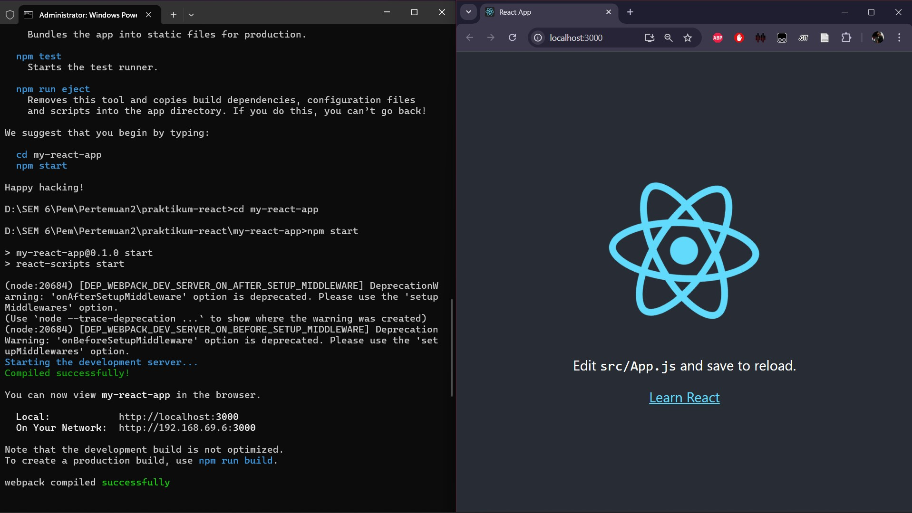
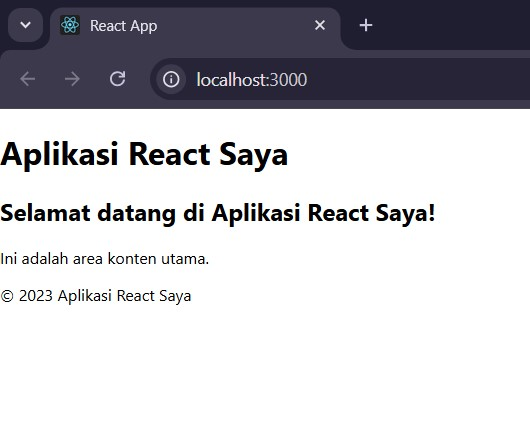
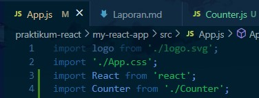
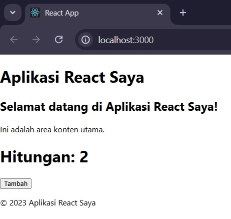
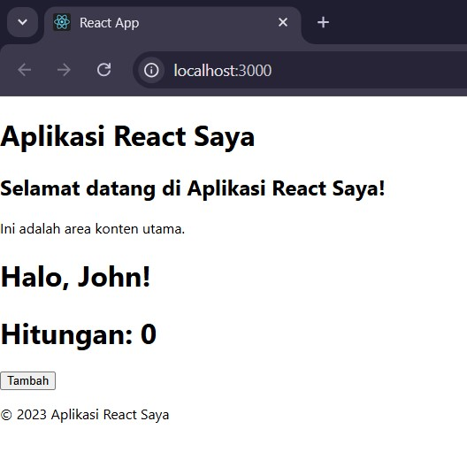
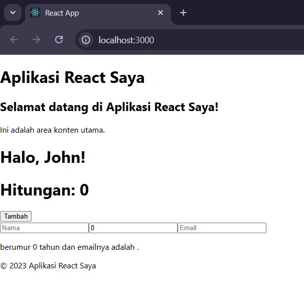
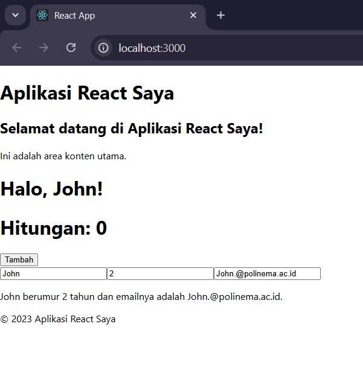
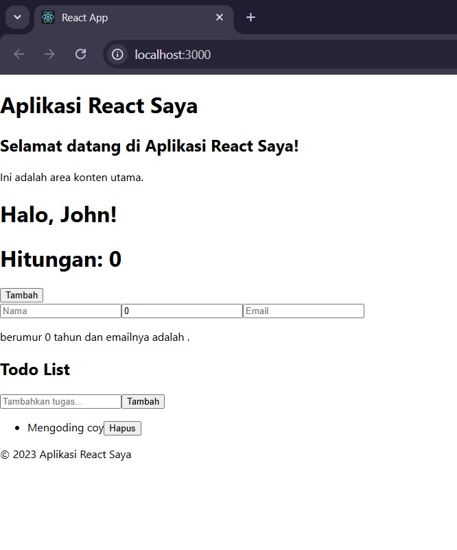

# Week 02 - REACTJS

**Nama :** Ellois Karina Handoyo `<br>`
**NIM :** 2241720154 `<br>`
**Kelas :** TI-3C `<br>`
**Absen :** 09

## 1. Persiapan Lingkungan



## 2. Membuat Komponen React

1. Buka file src/App.js di text editor Anda.
2. Ganti kode di dalamnya dengan kode berikut untuk membuat komponen sederhana:
3. Simpan file dan lihat perubahan di browser. Anda akan melihat tampilan sederhana dengan header, konten utama, dan footer.



## 3. Menggunakan JSX untuk Membuat Komponen Dinamis

1. Buat file baru di direktori src dengan nama Counter.js.
2. Tambahkan kode berikut untuk membuat komponen Counter yang dinamis:
   ``
3. Buka file src/App.js dan impor komponen Counter:



4. Tambahkan komponen Counter ke dalam komponen App:


5. Simpan file dan lihat perubahan di browser. Anda akan melihat tombol "Tambah" yang dapat meningkatkan hitungan saat diklik.



## 4. Menggunakan Props untuk Mengirim Data

1. Buat file baru di direktori src dengan nama Greeting.js.
2. Tambahkan kode berikut untuk membuat komponen Greeting yang menerima props:
   ``
3. Buka file src/App.js dan impor komponen Greeting:
4. Tambahkan komponen Greeting ke dalam komponen App dan kirim props name:
   ``
5. Simpan file dan lihat perubahan di browser. Anda akan melihat pesan "Halo, John!" yang ditampilkan oleh komponen Greeting.



## 5. Menggunakan State untuk Mengelola Data

1. Buka file src/App.js dan tambahkan kode berikut untuk membuat komponen yang mengelola state:
   ``
2. Tambahkan komponen Example ke dalam komponen App:
3. Simpan file dan lihat perubahan di browser. Anda akan melihat form input yang dapat mengupdate state dan menampilkan data yang dimasukkan.




## Tugas

1. Buat komponen baru bernama TodoList yang menampilkan daftar tugas (todo list). Gunakan
   state untuk mengelola daftar tugas dan props untuk mengirim data tugas ke komponen anak.
2. Tambahkan fitur untuk menambahkan tugas baru ke dalam daftar menggunakan form input.
3. Implementasikan fitur untuk menghapus tugas dari daftar.

Komponen ToDo List

```jsx
// Komponen untuk menampilkan satu tugas
function TodoItem({ task, onDelete }) {
  return (
    <li className="flex justify-between items-center p-2 bg-gray-100 rounded-lg shadow-sm mb-2">
      <span>{task}</span>
      <button
        onClick={onDelete}
        className="bg-red-500 text-white px-3 py-1 rounded-md hover:bg-red-600"
      >
        Hapus
      </button>
    </li>
  );
}

// Komponen utama TodoList
function TodoList() {
  const [tasks, setTasks] = useState([]);
  const [newTask, setNewTask] = useState("");

  // Menambahkan tugas baru ke daftar
  const handleAddTask = (e) => {
    e.preventDefault();
    if (newTask.trim() === "") return;
    setTasks([...tasks, newTask]);
    setNewTask("");
  };

  // Menghapus tugas dari daftar
  const handleDeleteTask = (index) => {
    const updatedTasks = tasks.filter((_, i) => i !== index);
    setTasks(updatedTasks);
  };

  return (
    <div className="max-w-md mx-auto p-4 bg-white shadow-lg rounded-lg">
      <h2 className="text-xl font-bold mb-4">Todo List</h2>
      <form onSubmit={handleAddTask} className="flex mb-4">
        <input
          type="text"
          value={newTask}
          onChange={(e) => setNewTask(e.target.value)}
          placeholder="Tambahkan tugas..."
          className="flex-1 p-2 border rounded-l-lg"
        />
        <button
          type="submit"
          className="bg-blue-500 text-white px-4 rounded-r-lg hover:bg-blue-600"
        >
          Tambah
        </button>
      </form>
      <ul>
        {tasks.map((task, index) => (
          <TodoItem key={index} task={task} onDelete={() => handleDeleteTask(index)} />
        ))}
      </ul>
    </div>
  );
}


// Komponen Header
function Header() {
  return (
    <header>
      <h1>Aplikasi React Saya</h1>
    </header>
  );
}

// Komponen Main
function Main() {
  return (
    <main>
      <h2>Selamat datang di Aplikasi React Saya!</h2>
      <p>Ini adalah area konten utama.</p>
    </main>
  );
}

// Komponen Footer
function Footer() {
  return (
    <footer>
      <p>© 2023 Aplikasi React Saya</p>
    </footer>
  );
}


function App() {
  return (
    <div>
      <Header />
      <Main />
      <Greeting name="John" />
      <Counter />
      <Example />
      <div className="flex justify-center items-center min-h-screen bg-gray-200">
      <TodoList />
    </div>  
      <Footer />
    </div>
  );
}
```

Menambahkan Komponen kedalam Komponen App

```jsx
    <div className="flex justify-center items-center min-h-screen bg-gray-200">
    <TodoList />
    </div>  
```

Menambahkan ToDo List
``

Menghapus ToDo List


